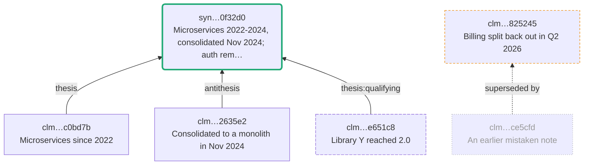

# Drawing a workspace

A DKF workspace is a graph — claims and syntheses joined by typed input edges,
particulars joined by merge records — but `recall` returns a list, `lineage`
returns a tree of JSON, and `conflicts` returns three sets of ids. The shape is
what carries the meaning in this format: which claim was the antithesis, which
synthesis is current, what a retraction orphaned.

```sh
particulars export --format mermaid --subject "Project X"   # the dialectic
particulars export --format dot                             # the workspace map
```

Neither needs Graphviz installed. The command emits text; you render it, or let
GitHub render the Mermaid for you.

## The lineage view

With `--subject`, one particular's reasoning — computed across its merge
equivalence class, so naming either of two merged particulars draws both.



Everything the workspace treats differently looks different:

| | Meaning |
|---|---|
| **Bold green outline** | the current belief — the most recent non-retracted synthesis |
| **Amber dashes** | `unsynthesised`: asserted, not yet reconciled into the belief |
| **Red dashes** | `stale`: cites a retracted input, directly or transitively |
| **Grey dots** | retracted (only with `--include-retracted`) |
| **Long dashes** | an input about a *different* particular |
| Rounded node | a synthesis; rectangular is a claim |
| Dotted arrow | `superseded-by`, not an input |

`--depth <n>` bounds how far the inputs are followed. Unreconciled claims are
drawn whatever the depth: they are roots of their own, and they are usually the
reason you are looking.

## The workspace map

Without `--subject`, one node per particular — weighted by how much is known
about it, carrying its conflict priority, joined by merge records:

```
digraph particulars {
  rankdir=BT;
  n1 [label="Project X\n4 claims, priority 1", shape=ellipse, penwidth=1.8, color="#ee8800", style="rounded,dashed"];
  n2 [label="Other Thing", shape=ellipse];
  n3 [label="Library Y\n1 claim, priority 1", shape=ellipse, penwidth=1.2, color="#ee8800", style="rounded,dashed"];
}
```

A particular with no claims still appears — an orphan is a thing worth seeing.

## Rendering

```sh
brew install graphviz                                              # or apt install graphviz
particulars export --format dot --out graph.dot && dot -Tsvg graph.dot -o graph.svg
particulars export --format dot | dot -Tpng -Gdpi=140 -o graph.png
```

Graphviz parses the output without warnings, and the rendered SVG carries one
`class="node"` per node and one `class="edge"` per edge — worth checking with
`grep -c` if you ever suspect a label has swallowed part of the graph.

Mermaid needs no tooling: paste it into a fenced ` ```mermaid ` block in any
markdown file, pull request comment, or issue on GitHub and it renders. So does
this documentation — the diagram above is the command's literal output.

`--out <path>` writes the file and prints a summary instead of the drawing;
`--json` prints `{format, view, subject?, nodes, edges, path?}`.

## Node identity

Node ids are generated (`n1`, `n2`, …), never derived from object ids. UUIDv7
ids share a long common prefix, so any truncation collapses distinct objects
into one node — a bug that produces a *plausible* diagram, which is worse than
one that fails. Each label carries `clm…c0bd7b`: enough to find the file,
taken from the end where ids actually differ.

Output is deterministic — nodes sorted by object id, edges by endpoint — so a
diagram committed to a repository diffs cleanly and a rerun changes nothing.

## Scope, and what a diagram discloses

**Personal knowledge is drawn by default**, unlike
[`--format graph`](graph.md), which refuses it outright. Writing a local file is
not a transfer to a third party, and a diagram silently missing half the graph
would misrepresent the reasoning it claims to show.

`--scope organisation` or `--scope public` narrows it when the drawing is going
somewhere less private.

**A diagram discloses whatever it contains.** Publishing one — in a pull request
comment, a wiki, a slide — is the same judgement as publishing the objects
themselves, and it is not a judgement the command can make for you: it cannot
know where its stdout ends up. This is the same trap `validate` warns about with
`scope_wider_than_inputs`, one level up: a summary can carry the substance of
things that were withheld. Check `--scope` before pasting.

## In a pull request

`docs/examples/dkf-check.yml` carries a commented-out step that draws the
particulars a pull request touches and folds the diagram into the existing
review comment. Turn it on and a reviewer sees the shape of what changed —
which claim is the antithesis, whether the new synthesis actually became the
current belief — without cloning the branch.

Before enabling it, decide whether the repository is one where every particular
it might draw is safe to render in a comment. In a **private** repository the
comment reaches exactly the people who can already read the YAML in the diff, so
the diagram discloses nothing the pull request does not; in a **public** one, add
`--scope organisation` to the export or leave the step off.

The step is bounded on both axes, and reports rather than hides what it drops:
`DEPTH: 2` keeps each diagram to what changed and what it reconciles,
`MAX_SUBJECTS` caps how many particulars are drawn and says how many were left,
and a lineage over `MAX_CHARS` is named with its node count and the command to
draw it locally instead of being pasted. A silent cap would read as "that is all
there was".
